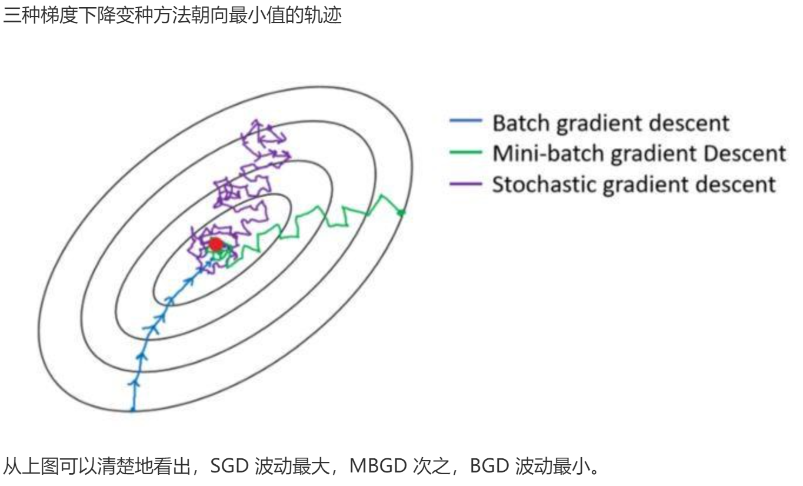

# 梯度下降
## 原理
类似于下山，我们如何找到一条直通山脚的路径，这就是梯度下降法的大白话。

想看视频的，我找了一个，请参考该B站链接：[不至于吧，梯度下降简单得有点离谱了啊！](https://www.bilibili.com/video/BV19f421Q7CL/?share_source=copy_web&vd_source=8a03b8f7d83afe5d05fff15bece5a63a)

## 解析
先明确我们的损失函数是什么，顾名思义，损失就是实际值和预测值之间的误差。
以一个点举例，假设实际值是 $(2,6)$，预测函数值是 $y=2x+1$，那么损失就是
$$loss=6-(2*2+1)=1$$
聪明的你此时会发现，正数好说，那如果算出来的差值是负数，那不就容易正负抵消了吗

如$(1,2)$，和预测函数值是 $y=2x+1$
$$loss=2-(1*2+1)=-1$$

所以我们需要对这个差值做平方（MSE）或者是取绝对值（MAE），这样我们的损失就变成正数了。

接着，对每一个点的损失求和，我们就可以得到一个损失函数，我们的目标就是让这个损失函数的值最小。

按照我们`ppt-8`上的内容
$$loss(h_w)=\sum_{j = 1}^{N}(y_j - (w_1x_j + w_0))^2$$
为了方便解释，现在我用 $k$ 替代 $w_1$，用 $b$ 替代 $w_0$，那么我们的损失函数就变成
$$loss(h_w)=\sum_{j = 1}^{N}(y_j - (kx_j + b))^2$$

损失函数说完了，那么如何进行下降呢，我们非常容易就可以从图上发现

其实从$A$下降到$B$就像我们爬山一样，越陡峭的地方自然就下降的越快，直到发现下降不了了。从高中知识可以得出，想获得下降的趋势，那么求导自然而然就是一个好方法

考虑到现在我们有两个参数 $k$ 和 $b$，那么我们自然就是对他们求偏导
对 $k$ 求偏导：
$$
\begin{align*}
\frac{\partial loss(h_w)}{\partial k}&=\frac{\partial}{\partial k}\sum_{j = 1}^{N}(y_j - (kx_j + b))^2\\
&=2\sum_{j = 1}^{N}(y_j - (kx_j + b))\cdot(-x_j)\\
&=-2\sum_{j = 1}^{N}x_j(y_j - (kx_j + b))
\end{align*}
$$
对 $b$ 求偏导：
$$
\begin{align*}
\frac{\partial loss(h_w)}{\partial b}&=\frac{\partial}{\partial b}\sum_{j = 1}^{N}(y_j - (kx_j + b))^2\\
&=2\sum_{j = 1}^{N}(y_j - (kx_j + b))\cdot(-1)\\
&=-2\sum_{j = 1}^{N}(y_j - (kx_j + b))
\end{align*}
$$

梯度下降的核心理念是，沿着梯度的反方向对参数进行更新，从而实现损失函数值的不断降低。这里的 “沿着梯度反方向” 具体如何操作呢？我们先明确求导得到的是函数的变化趋势，一开始，损失值$loss$通常较大，为了让$loss$减小，我们需要减去偏导函数值。
以参数 $k$ 的更新公式为例，（我们先忽略掉里面的 $α$ ），得到:
$$k = k - \frac{\partial loss(h_w)}{\partial k}$$
若在更新参数时使用加号，即$k = k + \frac{\partial loss(h_w)}{\partial k}$，
那么参数$k$的更新方向就会变成梯度的正方向，也就是损失函数值增大的方向，这显然与我们期望损失函数值减小的目标相悖。而使用减号$k = k - \frac{\partial loss(h_w)}{\partial k}$，参数$k$便会沿着梯度的反方向更新。在这个过程中，随着迭代次数的不断增加，每一次更新都能让损失函数值朝着减小的方向变化，损失函数值会逐渐逼近最小值，我们也就能找到让模型预测效果达到最佳的参数值。

更新参数 $k$ 的公式为：
$$k = k - \alpha\frac{\partial loss(h_w)}{\partial k}$$

更新参数 $b$ 的公式为：
$$b = b - \alpha\frac{\partial loss(h_w)}{\partial b}$$

我们通过不断地重复这个更新过程，直到损失函数的值收敛到一个较小的值，或者达到预设的迭代次数。这时候得到的参数 $k$ 和 $b$ 就是我们希望找到的最优参数，使得预测函数能够尽可能准确地拟合实际数据。

聪明的你此时能发现为什么有个 $\alpha$ ，它叫是学习率（_**learning rate**_），决定了每次参数更新的步长。
**想要继续深入了解学习率，请参考这篇文章**：[学习率](./learning_rate.md)


## 变种
### 批量梯度下降（BGD）
#### 基本原理
想象你要找一个山谷的最低点，批量梯度下降就像是把整个山谷的地形都考察一遍后再决定往哪走。在机器学习里，就是把所有的训练数据都拿过来，计算一次梯度，这个梯度就代表了当前位置的坡度和方向，然后根据这个梯度来更新模型的参数，朝着损失函数（可以理解为山谷的深度）最小的方向走一步。每走一步都要把所有数据都用上算一次，就好像每决定下一步往哪走，都要把整个山谷的情况都看一遍。
#### 优点
- **准确性高**：因为每次更新都考虑了所有数据，所以它找到的方向是比较准确的，最终能比较稳定地找到山谷的最低点，也就是能让模型的损失函数达到比较好的最小值，模型的精度会比较高。
- **收敛稳定**：走的每一步都比较稳，不会出现突然跑偏的情况，只要数据和问题本身是合适的，它就会很稳定地朝着最优解靠近。
#### 缺点
- **计算量巨大**：如果数据量特别大，比如有几百万条数据，那每次更新都要把这几百万条数据都算一遍，这就非常耗时耗力，计算成本很高。
- **不适合在线学习**：因为它要一下子处理所有数据，所以很难实时地处理新进来的数据，不太适合那种数据不断动态增加的场景。
#### 代码
``` python
for i in range(nb_epochs):
    params_grad = evaluate_gradient(loss_function, data, params) 
    params = params - learning_rate * params_grad
```

### 随机梯度下降（SGD）
#### 基本原理
随机梯度下降就像是在山谷里探险，每次只看眼前的一小步，随机选一个点来看看坡度，然后就朝着这个点指示的方向走一步。在机器学习中，就是每次只从训练数据里随机选一个样本，根据这个样本计算梯度来更新参数。它不管其他数据怎么样，就根据这一个样本的情况来决定下一步往哪走，就像在山谷里只看眼前这一小块地方的坡度就决定怎么走。
#### 优点
- **计算速度快**：每次只需要处理一个样本，所以计算量非常小，在数据量很大的情况下，它的速度优势就特别明显，能很快地进行参数更新。
- **适合在线学习**：新来了一条数据，马上就可以用它来更新模型，不需要等积累很多数据，所以很适合数据实时更新的场景，比如实时推荐系统等。
#### 缺点
- **准确性相对低**：因为每次只看一个样本，这个样本可能不能很好地代表整体数据的情况，所以它走的方向可能不太准，有时候会走偏，导致最终找到的不一定是真正的山谷最低点，模型的精度可能会差一些。
- **收敛过程不稳定**：它走的路线可能会比较曲折，不像批量梯度下降那样稳定地朝着一个方向走，会有很多波动，有时候可能会在接近最低点的地方又跑开了，需要更多的时间和步骤才能收敛。
#### 代码
``` python
for i in range(nb_epochs): 
    np.random.shuffle(data) 
    for example in data:
        params_grad = evaluate_gradient(loss_function , example , params)
        params = params - learning_rate * params_grad
```

### 小批量梯度下降（MBGD）
#### 基本原理
**重点！！**

小批量梯度下降（Mini-batch gradient descent ，MBGD）有时也会写作小批量随机梯度下降（Mini-batch stochastic gradient descent，mini-batch SGD），实践中往往也把 mini-batch SGD 简称 SGD，所以需要注意的是，有些文献和资料中，会用 SGD 代表 mini-batch SGD，而不是真的 SGD（随机梯度下降）。

为了克服上述两个变种的缺点，所以人们提出了小批量梯度下降，MBGD 算是上面两个变种的折中。在每一次更新参数时，既不使用所有样本，也不是一个样本一个样本地进行更新，而是使用一部分样本来进行更新。

#### 代码
``` python
# 这里设定的是50个样本为1个小批量
for i in range(nb_epochs): 
    np.random.shuffle(data)
    for batch in get_batches(data, batch_size=50): 
        params_grad = evaluate_gradient(loss_function, batch, params)             
        params = params - learning_rate * params_gr
```

### 三种变种算法的简单总结对比
每次迭代更新：
- BGD 拿到所有数据并把所有样本的梯度加起来，然后下降。
- SGD 遍历样本，每拿到一个样本就计算一次梯度，然后下降一次；
- MSGD 积累一部分样本后，计算这些样本的平均梯度，作为更新方向下降一次。

- 

## 引用
1. 学校课件
1. https://lumingdong.cn/summary-of-gradient-descent-algorithm.html