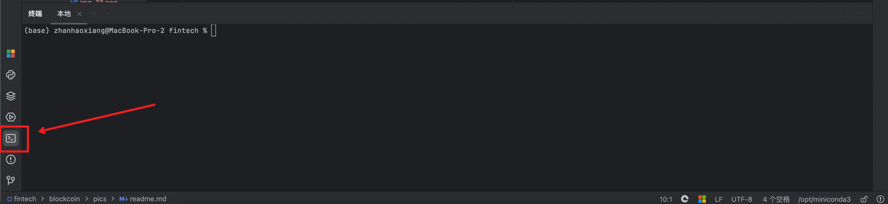
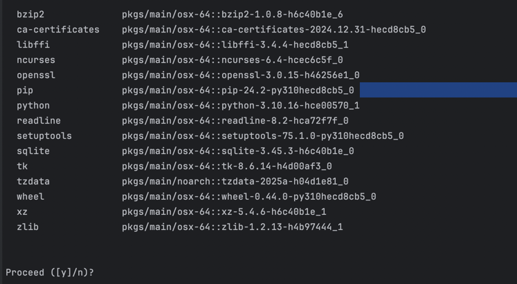
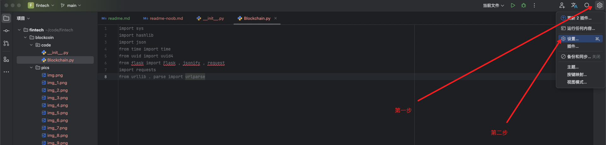
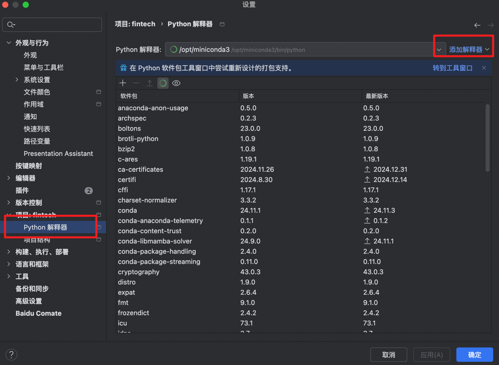
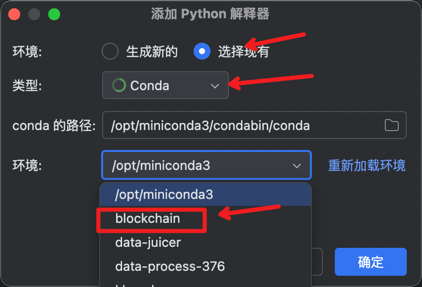
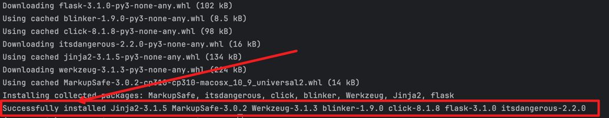
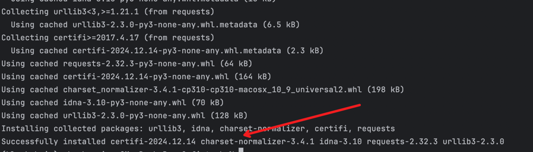
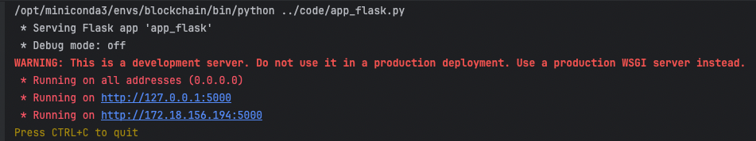
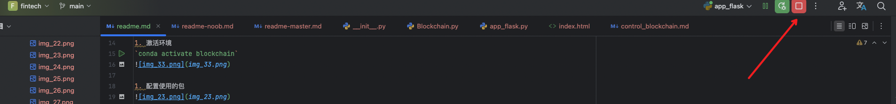

## 环境安装
这里分为两个版本：
- 小白版：适合完全没有编程基础的人：[文档-新手](pics/readme-noob.md)
- 老鸟版：适合有一定编程基础的人：[文档-老鸟](pics/readme-master.md)

## 环境安装
1. 下载相应的环境

`conda create -n blockchain python=3.10`

1. 确认

1. 激活环境
`conda activate blockchain`

1. 配置使用的包

1. 安装需要的依赖包
`pip install flask`，下图就是安装成功的显示

1. `pip install requests`，下图就是安装成功的显示

## 运行
1. `python ../code/app_flask.py`
看到下面这个就证明运行成功了，服务已经启动

1. 访问`http://localhost:5000/`

1. 开始使用，如果想要退出
