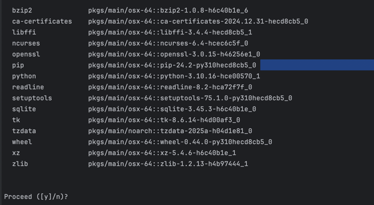
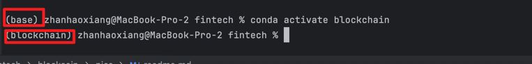
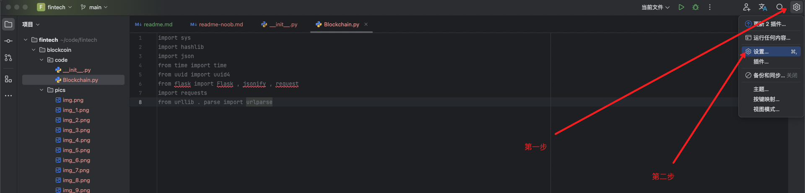
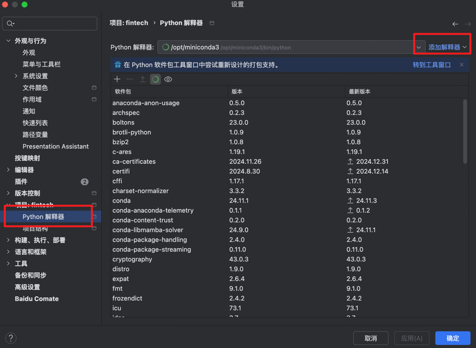
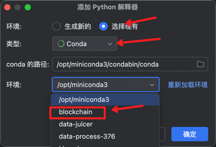
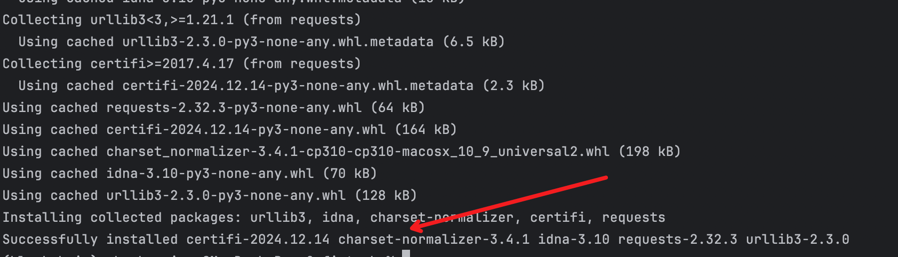
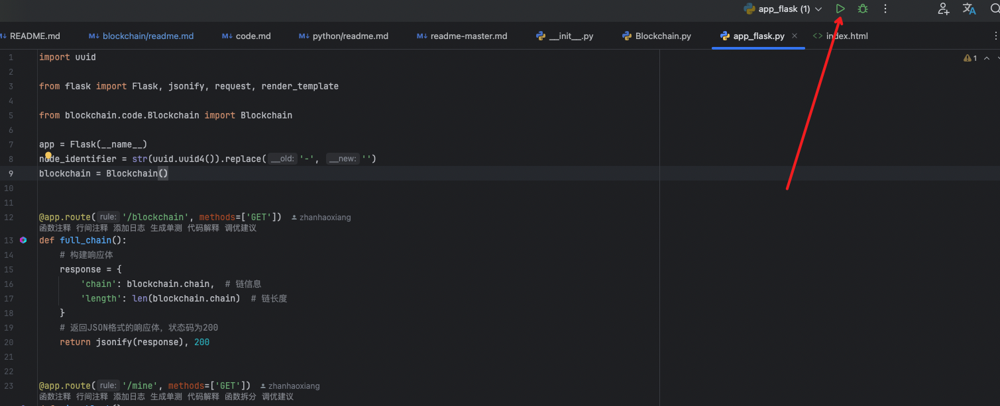
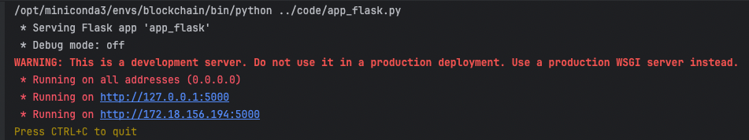
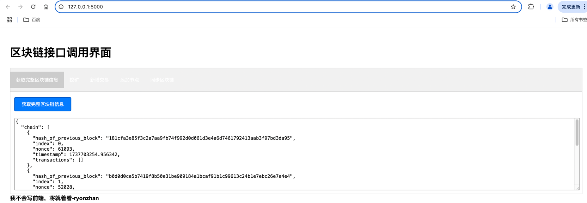
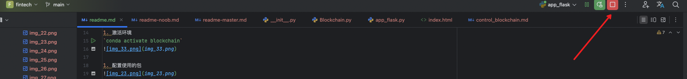

# 理论
## 代码解析
[代码解析文档](code.md)

tips：看看就好，真了解还得看实操

# 实操
## 环境安装
### 下载相应的环境

找到上图的地方，打开命令行，输入并执行：`conda create -n blockchain python=3.10`

### 确认

输入`y`以确认创建环境

### 激活环境
环境创建完成后，需要对环境进行激活，继续在命令行执行：`conda activate blockchain`

### 配置使用的包

### 安装需要的依赖包
1. 在命令行执行：`pip install flask`
2. 下图就是安装成功的显示

3. 在命令行执行：`pip install requests`
4. 下图就是安装成功的显示

## 运行
1. 执行
- 在命令行执行：`python ./code/app_flask.py`
- 或者找到app_flask文件后点击右上角的执行按钮进行执行
看到下面这个就证明运行成功了，服务已经启动

2. 访问`http://localhost:5000/`
，进行相关操作

3. 如果想要退出
