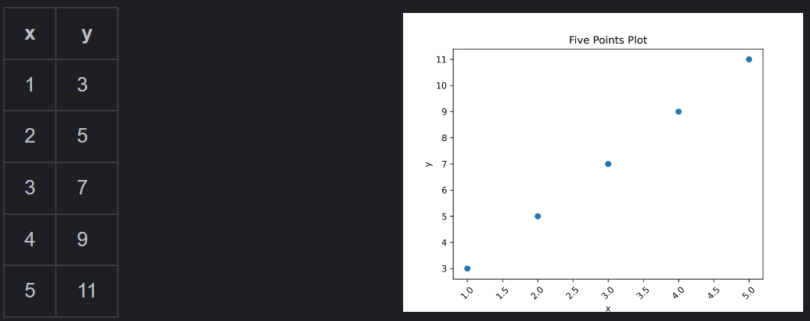
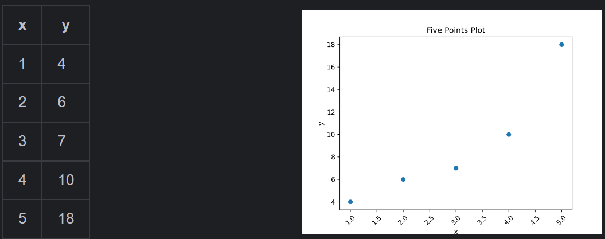

# 一元回归

鉴于天书讲的实在是太抽象，这里我接地气一点，提出一个实际的问题，然后我们解决这个实际的问题，然后你就懂里面的知识点了。

**以下我将由浅入深给你做解释，如果你这都看不懂，打钱给我，我手把手叫教你。**

## 问题

现在在一个`x-y`轴上，存在几个点，现在我想用一条直线去拟合这几个点，使得这条直线的误差最小。

举个🌰，现在我有五个点：

聪明的你可以一眼就看出来，噢，这是一条y=2x+1的直线。
但是假设我换一下，比如

你是不是就傻眼了，所以基于此，提出了一元回归问题，即如何拟合出最佳的一条直线。

下面的实际运算我也将取后者来进行计算，即五个点，分别为
**(1,4),(2,6),(3,7),(4,10),(5,18)**

---

## 最小二乘法
### 原理
最小二乘法的核心思想是通过最小化误差的平方和来确定回归直线的参数。在一元线性回归中，我们假设回归直线方程为 $y = kx + b$
，其中$k$是斜率，$b$ 是截距。

对于给定的 $n$ 个数据点 $(x_i, y_i)$（$i = 1,2,\cdots,n$），使用回归直线预测的值 $\hat{y}_i=kx_i + b$ 与真实值 $y_i$
之间存在误差 $e_i=y_i - \hat{y}_i=y_i - (kx_i + b)$。

最小二乘法的目标就是找到合适的 $k$ 和 $b$
，使得误差平方和 $S(k,b)=\sum_{i = 1}^{n}e_i^2=\sum_{i = 1}^{n}(y_i - (kx_i + b))^2$ 达到最小。

### 求解公式
为了找到使 $S(k,b)$ 最小的 $k$ 和 $b$，我们分别对 $k$ 和 $b$ 求偏导数，并令偏导数等于 0。

- 对 $b$ 求偏导：
  令 $\frac{\partial S}{\partial b}=-2\sum_{i = 1}^{n}(y_i - (kx_i + b)) = 0$
  ，经过化简可得 $nb + k\sum_{i = 1}^{n}x_i=\sum_{i = 1}^{n}y_i$。

- 对 $k$ 求偏导：
  令 $\frac{\partial S}{\partial k}=-2\sum_{i = 1}^{n}(y_i - (kx_i + b))x_i = 0$
  ，化简后得到 $b\sum_{i = 1}^{n}x_i + k\sum_{i = 1}^{n}x_i^2=\sum_{i = 1}^{n}x_iy_i$。

联立上述两个方程求解，最终可以得到 $k$ 和 $b$ 的计算公式：

- 斜率 $k$ 的计算公式：
  $$k=\frac{\sum_{i = 1}^{n}(x_i-\bar{x})(y_i - \bar{y})}{\sum_{i = 1}^{n}(x_i-\bar{x})^2}$$

- 截距 $b$ 的计算公式：
  $$b=\bar{y}-k\bar{x}$$

其中，$\bar{x}=\frac{1}{n}\sum_{i = 1}^{n}x_i$ 是 $x$ 的均值，$\bar{y}=\frac{1}{n}\sum_{i = 1}^{n}y_i$ 是 $y$ 的均值。
### 代码
[代码跳转](simple_linear_regression.py)

或者
`python simple_linear_regression.py`

### 优缺点
- **优点**：计算过程相对简单，并且存在解析解，能够直接通过公式计算出最优的 $k$ 和 $b$，无需进行复杂的迭代计算。
- **缺点**：对异常值较为敏感，因为异常值的误差平方会在误差平方和的计算中占据较大比重，从而可能对回归直线的拟合效果产生较大影响。此外，当数据量非常大时，小心oom。

## 梯度下降法
### 原理
类似于下山，我们如何找到一条直通山脚的路径，这就是梯度下降法的大白话。

想看视频的，参考该B站链接：[不至于吧，梯度下降简单得有点离谱了啊！](https://www.bilibili.com/video/BV19f421Q7CL/?share_source=copy_web&vd_source=8a03b8f7d83afe5d05fff15bece5a63a)

### 解析
如果想看文字版的，请继续阅读，我会按照实战取解析，建议对着代码一起阅读。

[文字版解析](../../../../ai/gradient_descent.md)

### 代码
这里我实现的是最简单的BGD

[代码跳转](gradient_descent.py) 

或者
`python gradient_descent.py`
