## 小白版
本期教程撰写时间为2025-01-24，如遇页面改版，自行解决
笔者作为n年老开发，用过的ide不下五种，还是觉得jetbrains家的比较好用，所以这里就以pycharm为例。
如果你安装过程中出现了问题，千万不要搞东搞西，联系我就好。

## 安装pycharm
### mac版本
1. 打开浏览器，输入网址：[https://www.jetbrains.com/pycharm/](https://www.jetbrains.com/pycharm/)
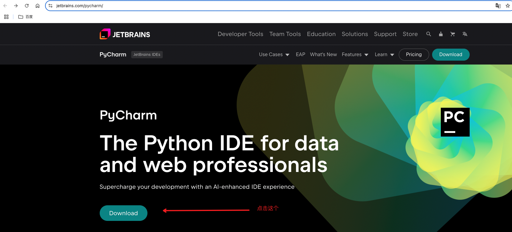

1. 这里有两个版本，一个是社区版（Community），另一个是商业版（Professional）。刚进入这个网站，你应该会看到商业版，用鼠标往下滑，你就可以看到社区版。
⚠️：这里需要你清楚自己电脑架构是苹果芯片的还是intel芯片的
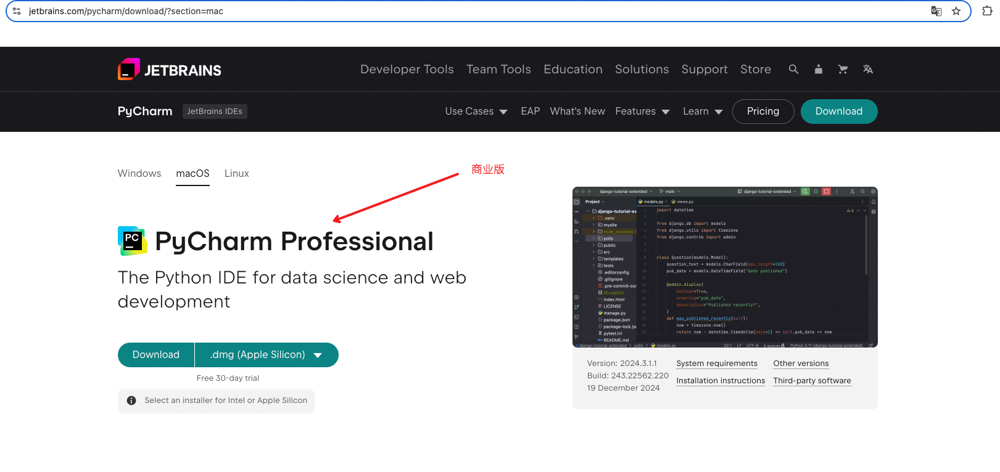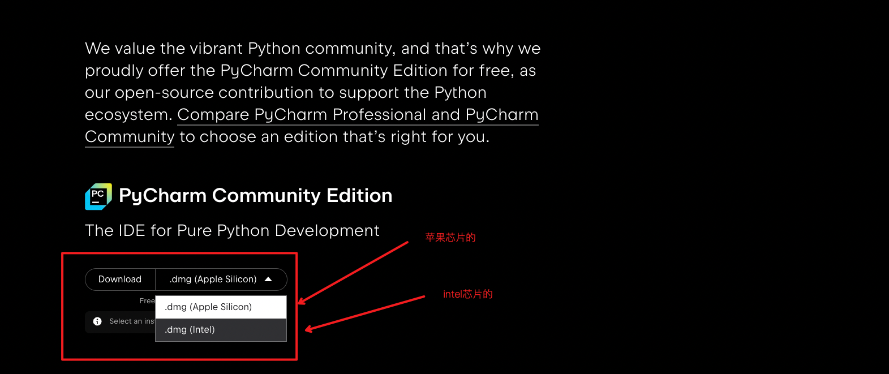

1. 将PyCharm.app拖入到应用程序中。（这个我懒得配图了，右手就行）

### windows版本
鉴于笔者现在在用mac，我用了别人教程里的图，侵删。
1. 打开浏览器，输入网址：[https://www.jetbrains.com/pycharm/](https://www.jetbrains.com/pycharm/)

1. 这里有两个版本，一个是社区版（Community），另一个是商业版（Professional）。刚进入这个网站，你应该会看到商业版，用鼠标往下滑，你就可以看到社区版。
⚠️：这里需要你清楚自己电脑架构是x86还是arm的
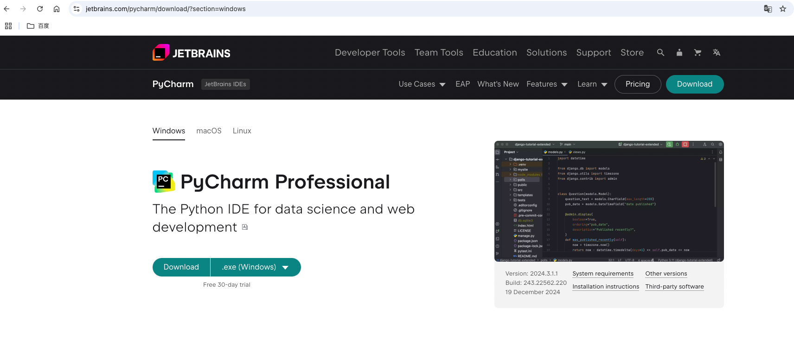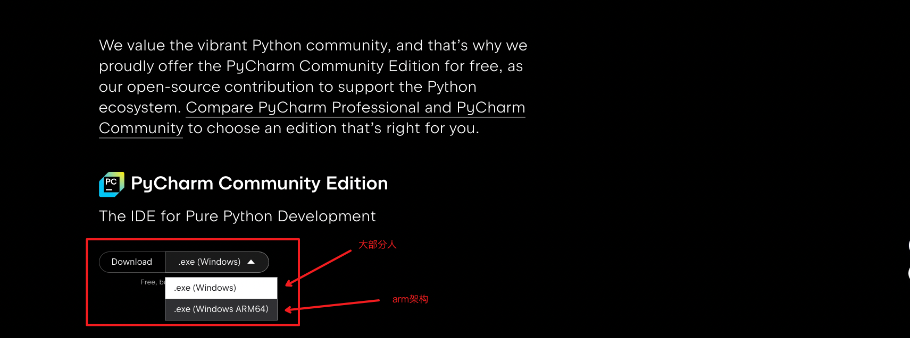
1. 安装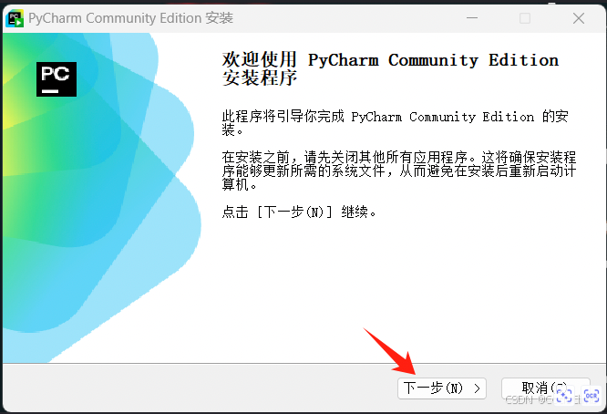
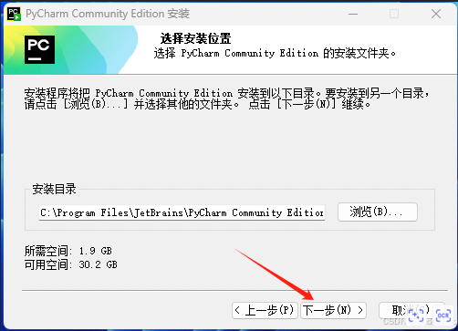
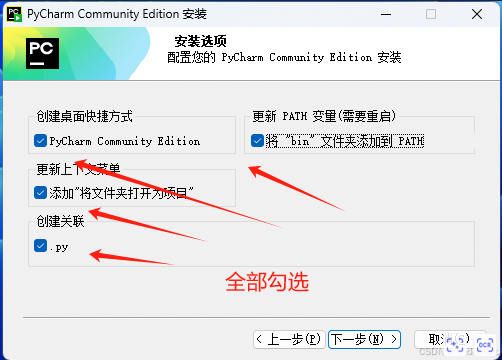 
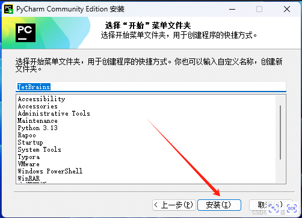
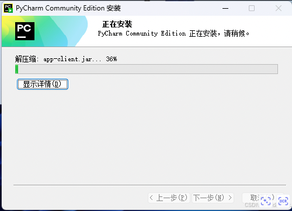
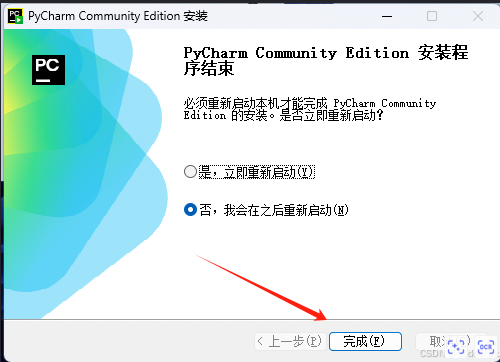

## 安装anaconda
如果你问我为什么要安装这个，那我只能说，听我的没有错，这是一个包管理的工具，因为python其实就是靠各种包来运行的，而anaconda就是帮你管理这些包的。如果不做好包管理，到后期的时候极其出现版本冲突的问题。
1. 打开浏览器，输入网址：https://www.anaconda.com/download/success
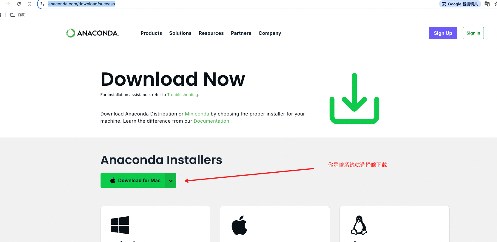

1. 按照提示安装即可（请自觉使用各类默认配置，不要搞东搞西）

## 使用
### 创建项目
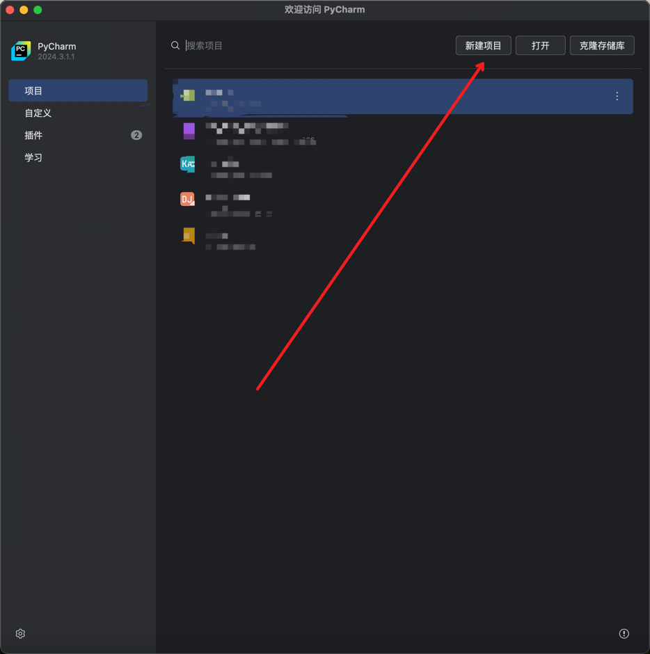
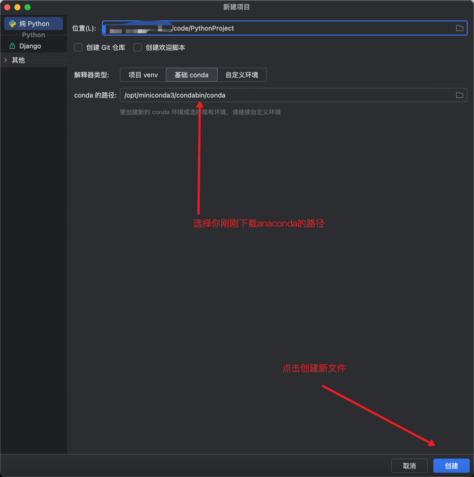

### 拉取远程项目
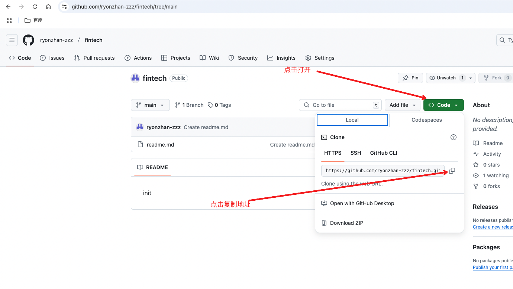
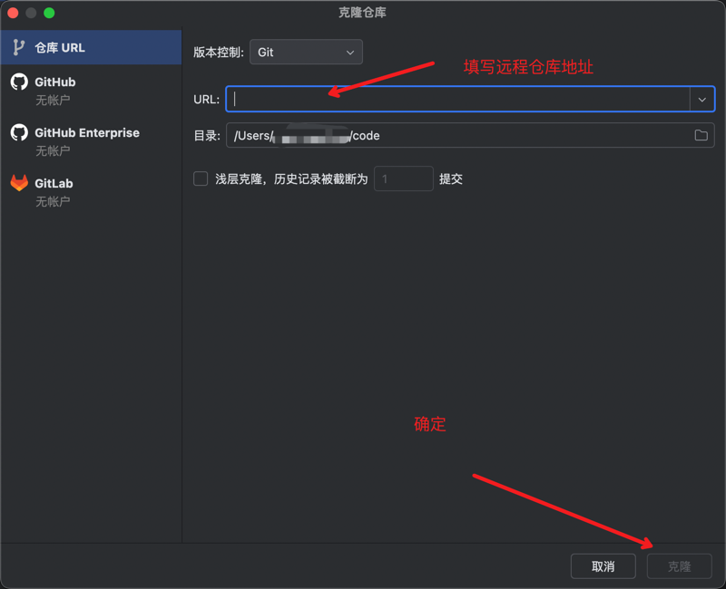

### 配置包管理工具

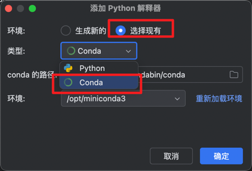

## 引用
1. https://blog.csdn.net/CodeClimb/article/details/144068011
2. https://blog.csdn.net/2302_76672693/article/details/144267428